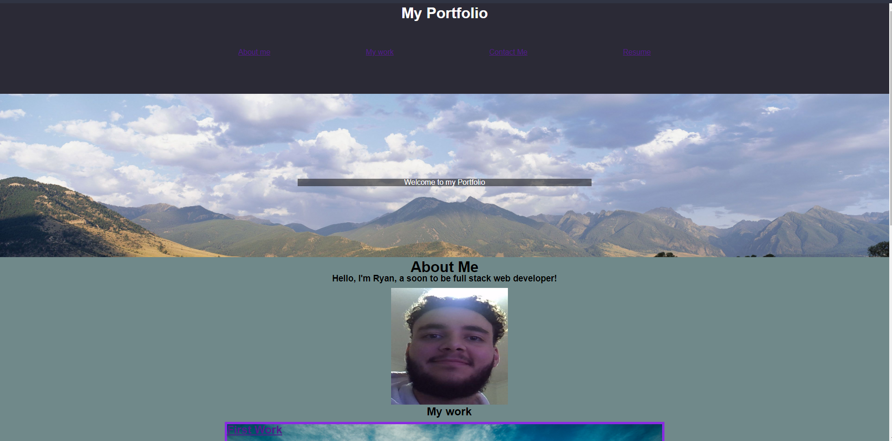

# Mini Project 2
The challenge required students view a potential employee's deployed portfolio of work samples.

The html shows a page called portfolio that shows contacts and a few 
CSS files were used for site accessabilty and looks. 

  Contents:
    - HTML File
    - Assets Folder
      - Images
      - CSS file

The HTML file should be accessable from the https link: https://github.com/RyanZade/challange-2.git

RyanZade
